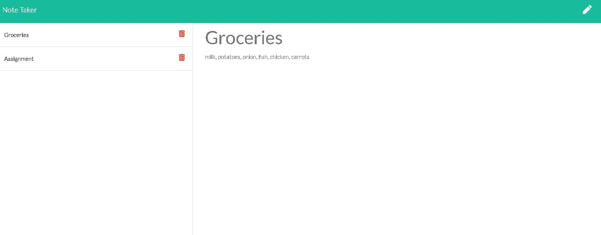

  # Welcome to Note Taker (1.0.0)
  <a href="#">
    
  </a>


  ## Description 

  > 
This application is used to write, save, and delete notes. This application is using an express backend and save and retrieve note data from a JSON file.

The following routes are used to connect frontend and backend :


* HTML routes:

  * `/notes` - Returns the `notes.html` file.

  * `/` - Return the `index.html` file

* HTML routes: API routes
 
  * GET `/api/notes` - Reads the `db.json` file and return all saved notes as JSON.

  * POST `/api/notes` - Receives a new note to save from the request body and adds it to the `db.json` file, and then return the new note to the client.

  * DELETE `/api/notes/:id` - Receives a query parameter containing the id of a note to delete. 
  Each note contains a unique id.

  ---
### Screen shots
---




---
 
  ## Table of Contents

  * [Homepage](#homepage)
  * [Installation](#installation)
  * [Usage](#usage)
  * [Tests](#tests)
  * [Author](#author)
  * [Contributing](#contributing)
  * [License](#license)
  * [Questions](#questions)
  
  
  ## Homepage

  🏠 [Homepage](https://github.com/arpita-sahakar/employee-summary#readme)
  

  ## Installation
  Run the following command to install all the required libraries
  ```bash
  npm install
  ```

 
  ## Usage 
   Run the following command to start the server
  ```bash
  nodemon app.js
  ```


  ## Tests
  ```bash
  npm run test
  ```


  ## Author

  👤 **Arpita Kar**
  * GitHub: [@arpita-sahakar](https://github.com/arpita-sahakar)


  ## Contributing

  Contributions, issues and feature requests are welcome!

  Feel free to check [issues page](https://github.com/arpita-sahakar/express/issues). You can also take a look at the [contributing guide](https://github.com/arpita-sahakar/express).


  ## Questions

  Please send your questions and suggestions to [my email](arpita.sahaa@gmail.com)
  * GitHub: [@arpita-sahakar](https://github.com/arpita-sahakar)


  ## License

  Copyright © 2020 [Arpita Kar](https://github.com/arpita-sahakar).

  This project is [NPM](https://github.com/arpita-sahakar/expressy/blob/main/license) licensed.

  
 